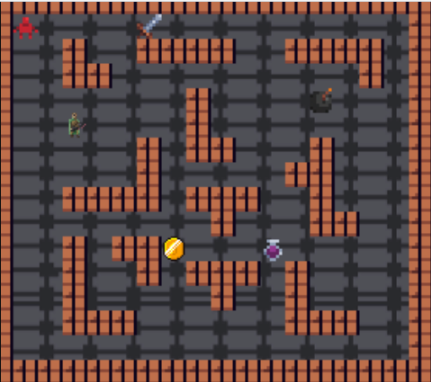

# **DungeonMania**

## About the Project
Within the course COMP2511 22T2, I was apart of a group project that developed the backend for a game called
'Dungeon Mania'. This is a Pac-Man like simulation where a Player has to avoid enemies and collect gold along with 
other goals/missions within the game. The entire project was constructed in Java.

###  *Java Skills Used*
- 